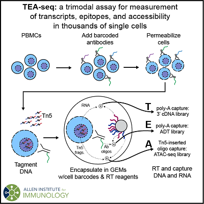

## aifi-swanson-teaseq

#### Under Revision

This repository and the associated manuscript are currently under review. Expect revisions and alterations to the code here to make it more streamlined, reusable, and address reviewer comments.

#### Code related to Swanson, *et. al*. for scATAC-seq, ICICLE-seq,   
#### and TEA-seq data processing, analysis and visualization.  



<a name="con"></a>

### Contents

#### [Manuscript/Citation](#man)  

#### [Protocols](#pro)  

#### [GEO Repository](#geo)  

#### [dbGaP Repository](#dbgap)  

#### [BarCounter](#bar)  
- [Main Repository](#bar-mai)  
- [Requirements/Inputs](#bar-req)  
- [Usage](#bar-usa)  

#### [General Notes](#gen)  
- [Genome Builds](#gen-gen)  
- [Computing Environment](#gen-com)  
- [Software Dependencies](#gen-sof)  
- [Reference Region Sets](#gen-ref)

#### [scATAC-seq](#sca)  
- [Requirements/Inputs](#sca-req)  
- [Datasets](#sca-dat)  
- [Preprocessing](#sca-pre)  
- [Analysis](#sca-ana)  

#### [ICICLE-seq](#ici)  
- [Requirements/Inputs](#ici-req)  
- [Datasets](#ici-dat)  
- [Preprocessing](#ici-pre)  
- [Analysis](#ici-ana)  

#### [TEA-seq](#tea)  
- [Requirements/Inputs](#tea-req)  
- [Datasets](#tea-dat)  
- [Preprocessing](#tea-pre)  
- [Analysis](#tea-ana)  

#### [10x Multiome ATAC + Gene Expression](#10m)  
- [Requirements/Inputs](#10m-req)  
- [Datasets](#10m-dat)  
- [Preprocessing](#10m-pre)  
- [Analysis](#10m-ana)  

#### [CITE-seq](#cite)  
- [Requirements/Inputs](#cite-req)  
- [Datasets](#cite-dat)  
- [Preprocessing](#cite-pre)  
- [Analysis](#cite-ana)  

#### [All Datasets](#all-dat)

#### [Legal](#leg)
- [License](#leg-lic)  
- [Level of Support](#leg-lev)  
- [Contributions](#leg-con)  

------------

<a name="man"></a>

### Manuscript

The TEA-seq manuscript is currently available on bioRxiv at:  
https://www.biorxiv.org/content/10.1101/2020.09.04.283887v2  

Citation information:  
Elliott Swanson, Cara Lord, Julian Reading, Alexander T. Heubeck, Adam K. Savage, Richard Green, Xiao-jun Li, Troy R. Torgerson, Thomas F. Bumol, Lucas T. Graybuck, Peter J. Skene. *TEA-seq: a trimodal assay for integrated single cell measurement of transcripts, epitopes, and chromatin accessibility* (2020). bioRxiv 2020.09.04.283887; doi: https://doi.org/10.1101/2020.09.04.283887

Coming soon to [eLife](https://elifesciences.org)!

[Return to Contents](#con)

------------

<a name="pro"></a>

### Protocols

A detailed bench protocol for TEA-seq written by Elliott Swanson is [available on protocols.io](https://www.protocols.io/view/tea-seq-bqagmsbw).

[Return to Contents](#con)

------------

<a name="geo"></a>

### GEO Repository

Data from Swanson, *et al.* will be available on GEO at [Series GSE158013](https://www.ncbi.nlm.nih.gov/geo/query/acc.cgi?acc=GSE158013)

The Rmarkdown Notebook at `data/00_geo_data_retrieval.Rmd` provides methods for quickly retrieving supplementary files from GEO.

See method-specific dataset descriptions below for details on specific GEO samples.

[Return to Contents](#con)

------------

<a name="dbgap"></a>

### dbGaP Repository

Raw (FASTQ) data from Swanson, *et al.* will be available on dbGaP at [Study accession   phs002316.v1.p1](http://www.ncbi.nlm.nih.gov/projects/gap/cgi-bin/study.cgi?study_id=phs002316.v1.p1)

[Return to Contents](#con)

------------

<a name="gen"></a>

### General Notes

<a name="gen-gen"></a>

**Genome Builds**  
All samples used in Swanson, *et al.* were from human donors. We use *GRCHg38/hg38* genome builds throughout our processing and analysis.

<a name="gen-txn"></a>

**Transcriptome Builds and gene annotations**  
For analysis, we utilized transcriptome annotations from multiple sources:  
- For preprocessing of scATAC-seq, we utilized ENSEMBLv93 annotations provided by the [10x Genomics 3' RNA-seq reference v3.1.0](https://support.10xgenomics.com/single-cell-gene-expression/software/release-notes/build#GRCh38mm10_3.1.0) (used in-house for RNA-seq pipelines). These annotations were used to assess FRITSS and for gene body counts in our preprocessing pipeline.
- For downstream analysis, we utilized the annotations stored in the [BioConductor `BSgenome.Hsapiens.UCSC.hg38` package](https://bioconductor.org/packages/release/data/annotation/html/BSgenome.Hsapiens.UCSC.hg38.html), which is imported by ArchR for scATAC-seq analysis.

<a name="gen-com"></a>

**Computing Environment**  
Preprocessing and analysis scripts were generated and run on Linux/Unix-like platforms (Debian/Ubuntu) with R >= v3.6.3 and 4.0.2 .  

<a name="gen-sof"></a>

**Software Dependencies**  

These software tools are used in various parts of our analysis and processing scripts:

*command-line tools*  
[`bcl2fastq`](https://support.illumina.com/sequencing/sequencing_software/bcl2fastq-conversion-software.html)  
[`cellranger count` >= v5.0.0](https://support.10xgenomics.com/single-cell-gene-expression/software/pipelines/latest/what-is-cell-ranger)   
[`cellranger-atac count` >= v1.0.0](https://support.10xgenomics.com/single-cell-atac/software/pipelines/latest/using/count)  
[`cellranger-arc count` >= v1.0.0](https://support.10xgenomics.com/single-cell-multiome-atac-gex/software/pipelines/latest/using/count)   
[`bedtools2`](https://github.com/arq5x/bedtools2/releases)  
[`bowtie2`](http://bowtie-bio.sourceforge.net/bowtie2/index.shtml)  
[`fastp`](https://github.com/OpenGene/fastp)  
[`GATK >= v3.7`](https://github.com/broadinstitute/gatk/releases)  
[`GNU Parallel`](https://www.gnu.org/software/parallel/)  
[`HTSlib and SAMtools`](http://www.htslib.org/download/)  

*Language requirements*  
[`python >= 3.7`](https://www.python.org/downloads/)  
[`R >= 3.6.3`](https://cran.r-project.org/)  

*Github R packages*  
[`ArchR`](https://www.archrproject.com/)  
[Custom `Seurat` for 3-way WNN](https://github.com/aifimmunology/Seurat)  
[`scrattch.vis`](https://github.com/AllenInstitute/scrattch.vis)  

*Other R packages*  
See the file [common/R_dependencies.R](https://github.com/AllenInstitute/aifi-swanson-teaseq/blob/master/common/R_dependencies.R) for additional dependencies from CRAN and BioConductor.

<a name="gen-ref"></a>

**Reference Region Sets**  
For ATAC-seq data analysis, we made use of several reference hg38 region sets from multiple sources. Retrieval and assembly of these regions for use in downstream analysis are available in the R script [`reference/get_reference_datasets.R`](https://github.com/AllenInstitute/aifi-swanson-teaseq/blob/master/reference/get_reference_datasets.R).  

The references used for analysis are:  
1. ENSEMBLv93 Gene bodies, filtered for genes used in 10x Genomics reference [`refdata-cellranger-GRCh38-3.0.0`](https://support.10xgenomics.com/single-cell-gene-expression/software/release-notes/build#grch38_3.0.0).  
2. ENSEMBLv93 TSS regions (TSS +/- 2kb) filtered as for **1.**  
3. scATAC-seq PBMC peaks from [Lareau, *et al.*](https://pubmed.ncbi.nlm.nih.gov/31235917/) at GEO Accession [GSE123577](https://www.ncbi.nlm.nih.gov/geo/query/acc.cgi?acc=GSE123577).  
4. ENCODE/Altius DNase-seq Index regions from [Mouleman, *et al.*](https://www.nature.com/articles/s41586-020-2559-3) at ENCODE File ID [ENCFF503GCK](https://www.encodeproject.org/files/ENCFF503GCK/).  

[Return to Contents](#con)

------------

<a name="bar"></a>

### BarCounter  

Barcode quantification was performed using the C program BarCounter developed by Elliott Swanson.  

We utilize BarCounter for the processing of ADT counts for both the ICICLE-seq and TEA-seq analyses, below.  

<a name="bar-mai"></a>

#### Main Repository  

For convenience, a version of BarCounter is linked to this repository, and will be cloned along with other repository code.  

The main repository for Barcounter releases is at [https://github.com/AllenInstitute/BarCounter](https://github.com/AllenInstitute/BarCounter).

[Return to Contents](#con)

<a name="bar-req"></a>

#### BarCounter Requirements/Inputs

In its current implementation, BarCounter expects reads to conform to the cell and UMI barcode positions used by 10x Genomics for 3' scRNA-seq and the CellRanger Multiome RNA + ATAC kits. In addition, standard Illumina-like FASTQ naming conventions are required.  

**Sequencing Data**  
- `R1`: 28 nt - First 16 nt are 10x Cell Barcodes; next 12 nt are UMIs  
- `R2`: 15 nt (or longer) - first 15 nt are Antibody/ADI barcodes. Reads may be longer if co-sequenced with RNA/ATAC data  

[Return to Contents](#con)

<a name="bar-usa"></a>

#### BarCounter Usage

*TODO*  

[Return to Contents](#con)
------------

<a name="sca"></a>

### scATAC-seq

The single-cell assay for transposase-accessible chromatin (scATAC-seq) is a method that utilizes the Tn5 transposase to insert short sequence tags into the genome - ideally without perturbing the native chromatin state, so that measured fragments reflect the true state of nuclear structure. In Swanson, et al., we compare nuclear isolation protocols and cell permeabilization to assess the quantitative and qualitative differences between scATAC-seq protocols, and to enable multimodal measurement of scATAC-seq with transcription and/or cell surface epitopes.

<a name="sca-req"></a>

#### scATAC-seq Requirements/Inputs

**Sequencing Data**  
The scATAC-seq preprocessing and analysis pipelines are built around libraries with the [10x Genomics scATAC-seq read structure](https://support.10xgenomics.com/single-cell-atac/sequencing/doc/specifications-sequencing-requirements-for-single-cell-atac):  
- `I1`: 8 nt, i7 Well/sample Indexes  
- `I2`: 16 nt, 10x Cell Barcodes  
- `R1`: 50 nt, ATAC-seq fragment insertion  
- `R2`: 50 nt, ATAC-seq fragment insertion  

[Return to Contents](#con)

<a name="sca-dat"></a>

#### scATAC-seq Datasets  

Because our samples all originate from human donors, raw data (FASTQ files) used for Swanson, *et al.* are in the process of submission to dbGAP for controlled access.  

Processed data from scATAC-seq datasets used in Swanson, *et al.* will be available for download from these GEO Samples:  

| Accession | PBMC Type | Perm/Nuc | Prep | Purification | Pur. Method | WellID |
| ---       | ---       | ---      | ---  | ---          | ---         | ---     |
| [GSM4784064](https://www.ncbi.nlm.nih.gov/geo/query/acc.cgi?acc=GSM4784064) |  leukapheresis | Perm | 0.01% Dig. |none | none | B003-W7 |
| [GSM4784065](https://www.ncbi.nlm.nih.gov/geo/query/acc.cgi?acc=GSM4784065) |  leukapheresis | Perm | 0.01% Dig. | FACS | D/D-Neu. | B003-W8 |
| [GSM4784066](https://www.ncbi.nlm.nih.gov/geo/query/acc.cgi?acc=GSM4784066) |  ficoll | Nuc | 1x 10xNIB |none | none | X024-W1 |
| [GSM4784067](https://www.ncbi.nlm.nih.gov/geo/query/acc.cgi?acc=GSM4784067) |  ficoll | Nuc | 0.25x 10xNIB |none | none | X024-W2 |
| [GSM4784068](https://www.ncbi.nlm.nih.gov/geo/query/acc.cgi?acc=GSM4784068) |  ficoll | Nuc | 0.1x 10xNIB |none | none | X024-W3 |
| [GSM4784069](https://www.ncbi.nlm.nih.gov/geo/query/acc.cgi?acc=GSM4784069) |  ficoll | Nuc | 1x ANIB |none | none | X024-W4 |
| [GSM4784070](https://www.ncbi.nlm.nih.gov/geo/query/acc.cgi?acc=GSM4784070) |  ficoll | Perm | 0.01% Dig. |none | none | X025-W1 |
| [GSM4784071](https://www.ncbi.nlm.nih.gov/geo/query/acc.cgi?acc=GSM4784071) |  ficoll | Perm | 0.05% Dig. |none | none | X025-W2 |
| [GSM4784072](https://www.ncbi.nlm.nih.gov/geo/query/acc.cgi?acc=GSM4784072) |  ficoll | Perm | 0.1% Dig. |none | none | X025-W3 |
| [GSM4784073](https://www.ncbi.nlm.nih.gov/geo/query/acc.cgi?acc=GSM4784073) |  ficoll | Perm | 0.2% Dig. |none | none | X025-W4 |
| [GSM4784074](https://www.ncbi.nlm.nih.gov/geo/query/acc.cgi?acc=GSM4784074) |  ficoll | Perm | 0.01% Dig. |none | none | X027-W1 |
| [GSM4784075](https://www.ncbi.nlm.nih.gov/geo/query/acc.cgi?acc=GSM4784075) |  ficoll | Perm | 0.01% Dig. | FACS | D/D-Neu. | X027-W3 |
| [GSM4784076](https://www.ncbi.nlm.nih.gov/geo/query/acc.cgi?acc=GSM4784076) |  ficoll | Perm | 0.01% Dig. | Mag. Bead | Negative | X032-W1 |
| [GSM4784077](https://www.ncbi.nlm.nih.gov/geo/query/acc.cgi?acc=GSM4784077) |  ficoll | Perm | 0.01% Dig. | Mag. Bead | anti-CD15 |  X032-W2 |
| [GSM4784078](https://www.ncbi.nlm.nih.gov/geo/query/acc.cgi?acc=GSM4784078) |  leukapheresis | Perm | 0.01% Dig. | Mag. Bead | Negative | X032-W3 |
| [GSM4784079](https://www.ncbi.nlm.nih.gov/geo/query/acc.cgi?acc=GSM4784079) |  leukapheresis | Perm | 0.01% Dig. | Mag. Bead | anti-CD15 | X032-W4 |
| [GSM4784080](https://www.ncbi.nlm.nih.gov/geo/query/acc.cgi?acc=GSM4784080) |  ficoll | Nuc | 1x 10xNIB |none | none | X041-W1 |
| [GSM4784081](https://www.ncbi.nlm.nih.gov/geo/query/acc.cgi?acc=GSM4784081) |  ficoll | Nuc | 1x 10xNIB | FACS | D/D | X041-W2 |
| [GSM4784082](https://www.ncbi.nlm.nih.gov/geo/query/acc.cgi?acc=GSM4784082) |  ficoll | Nuc | 1x 10xNIB | FACS | D/D-Neu. | X041-W3 |
| [GSM4784083](https://www.ncbi.nlm.nih.gov/geo/query/acc.cgi?acc=GSM4784083) |  ficoll | Perm | 0.01% Dig. |none | none | X041-W4 |
| [GSM4784084](https://www.ncbi.nlm.nih.gov/geo/query/acc.cgi?acc=GSM4784084) |  ficoll | Perm | 0.01% Dig. | FACS | D/D | X041-W5 |
| [GSM4784085](https://www.ncbi.nlm.nih.gov/geo/query/acc.cgi?acc=GSM4784085) |  ficoll | Perm | 0.01% Dig. | FACS | D/D-Neu. | X041-W6 |

[Return to Contents](#con)

<a name="sca-pre"></a>

#### scATAC-seq Preprocessing

*1. FASTQ Downsampling*  

To perform comparisons between wells, we downsampled the raw sequenced FASTQ reads to either 125 million read pairs or 200 million, based on the number of available reads in the compared samples. 

Downsampling was performed simply using `head`, as the reads in FASTQ files are not sorted. Note that FASTQ files have 4 lines per read, so the number of reads to select must be 4 * <N Reads>, i.e. 500,000,000 lines for 125 million reads.

Parallelized code used for these downsampling steps is available in [`scatac_preprocessing/00_fastq_downsampling.sh`](https://github.com/AllenInstitute/aifi-swanson-teaseq/blob/master/scatac_preprocessing/00_fastq_downsampling.sh).

*2. cellranger-atac count*  

After downsampling, reads were aligned using `cellranger-atac count` with default parameters for each well.

*3. Results processing*  

After `cellranger-atac count` alignment, we performed custom window counts and reference region counts for each cell barcode using a paralellized shell script built around `bedtools2`. This script uses the `singlecell.csv` and `fragments.tsv.gz` files generated by `cellranger-atac count` as inputs, and generates a variety of outputs for downstreat processing. The script is available in [`scatac_preprocessing/01_atac_preprocessing.sh`](https://github.com/AllenInstitute/aifi-swanson-teaseq/blob/master/scatac_preprocessing/01_atac_preprocessing.sh).

This script has the following parameters:

* `-b` Path to bedtools binary location
* `-g` Genome (hg19 or hg38)  
* `-i` Input fragments.tsv.gz
* `-j` N Parallel Jobs
* `-o` Output Directory
* `-s` Input singlecell.csv
* `-t` Temporary Directory
* `-w` Well ID

For example:  
```
bash 01_atac_preprocessing.sh \
  -b bedtools \
  -i X041-AP0C1W6/outs/fragments.tsv.gz \
  -g hg38 \
  -j 30 \
  -o X041-AP0C1W6/preprocessed \
  -s X041-AP0C1W6/outs/singlecell.csv \
  -t preprocessing_temp \
  -w X041-AP0C1W6
```

It outputs the following files:
 
- Altius Index sparse matrix: [WellID]_altius_sparse_matrix.tsv.gz  
- Reference Peaks sparse matrix: [WellID]_peaks_sparse_matrix.tsv.gz  
- TSS Region sparse matrix: [WellID]_tss_sparse_matrix.tsv.gz  
- Gene Bodies sparse matrix: [WellID]_gene_bodies_sparse_matrix.tsv.gz  
- Altius Index total counts: [WellID]_altius_total_counts.tsv.gz  
- Reference Peaks total counts: [WellID]_peaks_total_counts.tsv.gz  
- TSS Region total counts: [WellID]_tss_total_counts.tsv.gz  
- Gene Bodies total counts: [WellID]_gene_bodies_total_counts.tsv.gz  
- 5kb Window counts: [WellID]_window_5k_counts.tsv.gz
- 20kb Window counts: [WellID]_window_20k_counts.tsv.gz
- 100kb Window counts: [WellID]_window_100k_counts.tsv.gz
- UMI count frequencies (saturation curve): [WellID]_saturation_curve.tsv.gz
- Fragment width counts: [WellID]_fragment_widths.tsv.gz

*4. Custom QC filtering and reporting*  

With the results from preprocessing, we perform QC analysis and barcode filtering using and Rmarkdown file, which generates a report along with output files. The script at [`scatac_preprocessing/02_run_tenx_atac_qc.R`](https://github.com/AllenInstitute/aifi-swanson-teaseq/blob/master/scatac_preprocessing/02_run_tenx_atac_qc.R) is a parameterized wrapper around the markdown file at [`scatac_preprocessing/rmarkdown/tenx_atac_qc.Rmd`](https://github.com/AllenInstitute/aifi-swanson-teaseq/blob/master/scatac_preprocessing/rmarkdown/tenx_atac_qc.Rmd).

The wrapper has the following parameters:

* `-p` path to preprocessed directory from the previous step  
* `-s` path to `singlecell.csv` from `cellranger-atac count`  
* `-u` path to `summary.csv` from `cellranger-atac count`  
* `-k` a `SampleSheet.csv` file, described below  
* `-w` Well ID  
* `-g` Genome (hg38)  
* `-d` output files directory  
* `-o` path for the output HTML report file

For example:
```
mkdir X041-AP0C1W6/atac_qc/
Rscript 02_run_tenx_atac_qc.R \
  -p X041-AP0C1W6/preprocessed \
  -s X041-AP0C1W6/outs/singlecell.csv \
  -u X041-AP0C1W6/outs/summary.csv \
  -k X041_SampleSheet.csv \
  -w X041-AP0C1W6 \
  -g hg38 \
  -d X041-AP0C1W6/atac_qc/ \
  -d X041-AP0C1W6/X041-AP0C1W6_qc_report.html
```

The `SampleSheet.csv` file provides the relationship between Well IDs and Sample Names that are used for outputs. An example is shown below:
```
SampleID,BatchID,WellID,PoolID
nuc-none,X041,X041-AP0C1W1,X041-P0
nuc-dd,X041,X041-AP0C1W2,X041-P0
nuc-ddn,X041,X041-AP0C1W3,X041-P0
perm-none,X041,X041-AP0C1W4,X041-P0
perm-dd,X041,X041-AP0C1W5,X041-P0
perm-ddn,X041,X041-AP0C1W6,X041-P0
```

The script generates the following outputs in addition to the QC report:  

- Altius Index .h5 file: [BatchID]_[SampleID]_altius.h5  
- Reference Peak .h5 file: [BatchID]_[SampleID]_peaks.h5  
- Gene TSS .h5 file: [BatchID]_[SampleID]_tss.h5  
- Gene Bodies .h5 file: [BatchID]_[SampleID]_gene_bodies.h5  
- 5kb Window .h5 file: [BatchID]_[SampleID]_window_5k.h5  
- 20kb Window .h5 file: [BatchID]_[SampleID]_window_20k.h5  
- 100kb Window .h5 file: [BatchID]_[SampleID]_window_100k.h5  
- All barcode metadata: [BatchID]_[SampleID]_all_metadata.csv.gz  
- QC filtered barcode metadata: [BatchID]_[SampleID]_filtered_metadata.csv.gz  
- Saturation projection: [BatchID]_[SampleID]_saturation_projection.csv.gz  
- Fragment width summary: [BatchID]_[SampleID]_fragment_width_summary.csv.gz  
- JSON file: [BatchID]_[SampleID]_atac_qc_metrics.json  

*5. Fragment filtering*  

After QC analysis, we filter the `fragments.tsv.gz` file to retain only cell barcodes that pass QC. This is performed using the script at [scatac_preprocessing/03_filter_fragments.sh](https://github.com/AllenInstitute/aifi-swanson-teaseq/blob/master/scatac_preprocessing/03_filter_fragments.sh).

There are 6 parameters for this script:  

* `-i`: fragments.tsv.gz file from cellranger-atac outs/  
* `-m`: filtered_metadata.csv.gz file generated in the [previous step](#qc_out)  
* `-j`: N Parallel Jobs  
* `-o`: Path to an output directory  
* `-t`: Path to a temporary directory  
* `-s`: The sample name, e.g. [BatchID]_[SampleID]

For example:
```
bash 03_filter_fragments.sh \
  -i X041-AP0C1W6/outs/fragments.tsv.gz \
  -m X041-AP0C1W6/atac_qc/X041_perm-ddn_filtered_metadata.csv.gz \
  -j 30 \
  -o X041-AP0C1W6/atac_qc \
  -t filtering_temp \
  -s X041_perm-ddn
```

*6. Cell type labeling*  

Once filtered, the fragments file can be used as an input for [ArchR](https://www.archrproject.com/)-based cell type label transfer. As for step 4, this is implemented using a paramaterizing R script, [scatac_preprocessing/04_run_archr_atac_analysis.R](https://github.com/AllenInstitute/aifi-swanson-teaseq/blob/master/scatac_preprocessing/04_run_archr_atac_analysis.R), and an Rmarkdown report,  [scatac_preprocessing/rmarkdown/tenx_atac_archr_analysis.Rmd](https://github.com/AllenInstitute/aifi-swanson-teaseq/blob/master/scatac_preprocessing/rmarkdown/tenx_atac_archr_analysis.Rmd).

The wrapper requires these parameters:

* `-f`: The filtered_fragments.tsv.gz file from the previous step  
* `-s`: The sample name, e.g. [BatchID]_[SampleID]  
* `-g`: The genome (hg38)
* `-t`: The number of threads to use in parallel  
* `-d`: Path to an output directory  
* `-o`: Path for the output HTML report file  

For example:
```
mkdir X041-AP0C1W6/archr
Rscript 04_run_archr_atac_analysis.R \
  -f X041-AP0C1W6/atac_qc/X041_perm-ddn_filtered_fragments.tsv.gz \
  -s X041_perm-ddn \
  -g hg38 \
  -t 8 \
  -d X041-AP0C1W6/archr \
  -o X041-AP0C1W6/X041_perm-ddn_labeling_report.html
```

[Return to Contents](#con)

<a name="sca-ana"></a>

#### scATAC-seq Analysis

*Figure 1*  
[scatac_analysis/Figure-1_analysis.Rmd](https://github.com/AllenInstitute/aifi-swanson-teaseq/blob/master/scatac_analysis/Figure-1_analysis.Rmd)

*Figure 1 - Figure Supplement 2*  
[scatac_analysis/Figure-1-FS-2_analysis.Rmd](https://github.com/AllenInstitute/aifi-swanson-teaseq/blob/master/scatac_analysis/Figure-1-FS-2_analysis.Rmd)

*Figure 1 - Figure supplement 5*  
[scatac_analysis/Figure-1-FS-5_analysis.Rmd](https://github.com/AllenInstitute/aifi-swanson-teaseq/blob/master/scatac_analysis/Figure-1-FS-5_analysis.Rmd)

*Figure 2*  
[scatac_analysis/Figure-2_analysis.Rmd](https://github.com/AllenInstitute/aifi-swanson-teaseq/blob/master/scatac_analysis/Figure-1-FS-5_analysis.Rmd)

*Table 1*  
[scatac_analysis/Table-1_analysis.Rmd](https://github.com/AllenInstitute/aifi-swanson-teaseq/blob/master/scatac_analysis/Figure-1-FS-5_analysis.Rmd)

[Return to Contents](#con)

------------

<a name="bar"></a>

### BarCounter  

Barcode quantification was performed using the C program BarCounter developed by Elliott Swanson.  

We utilize BarCounter for the processing of ADT counts for both the ICICLE-seq and TEA-seq analyses, below.  

<a name="bar-mai"></a>

#### Main Repository  

For convenience, a version of BarCounter is linked to this repository, and will be cloned along with other repository code.  

The main repository for Barcounter releases is at [https://github.com/AllenInstitute/BarCounter-release](https://github.com/AllenInstitute/BarCounter-release).

[Return to Contents](#con)

<a name="bar-req"></a>

#### BarCounter Requirements/Inputs

In its current implementation, BarCounter expects reads to conform to the cell and UMI barcode positions used by 10x Genomics for 3' scRNA-seq and the CellRanger Multiome RNA + ATAC kits. In addition, standard Illumina-like FASTQ naming conventions are required.  

**Sequencing Data**  
- `R1`: 28 nt - First 16 nt are 10x Cell Barcodes; next 12 nt are UMIs  
- `R2`: 15 nt (or longer) - first 15 nt are Antibody/ADI barcodes. Reads may be longer if co-sequenced with RNA/ATAC data  

[Return to Contents](#con)

<a name="bar-usa"></a>

#### BarCounter Usage

BarCounter requires both a cell barcode list and a list of ADT tags for counting antibody UMI abundance. The cell barcode list can be either the full list of available barcodes or a filtered list of barcodes that pass QC criteria (e.g. `outs/filtered_feature_bc_matrix/barcodes.tsv` from CellRanger outputs).

BarCounter has the following parameters:

* `-w` path to a barcode "whitelist" `.txt` or `txt.gz` file  
* `-t` path to an ADT "taglist" `.csv` or `csv.gz` file  
* `-1` path to `summary.csv` from `cellranger-atac count`  
* `-2` a `SampleSheet.csv` file, described below  
* `-o` path to an output directory  

Full barcode lists for `-w` are provided by 10x Genomics in the cellranger files.  

They can be found in these locations relative to the base cellranger directory:  
CellRanger ARC v1.0.0: `cellranger-arc-1.0.0/lib/python/cellranger/barcodes/`  
CellRanger v3.1.0: `cellranger-3.1.0/cellranger-cs/3.1.0/lib/python/cellranger/barcodes/`  
CellRanger v4.0.0: `cellranger-4.0.0/lib/python/cellranger/barcodes/`  
CellRanger v5.0.0: `cellranger-5.0.0/lib/python/cellranger/barcodes/`  

The ADT taglist for `-t` should be a 2-column `.csv` file without a header, for example:  
```
CAGCCATTCATTAGG,CD10
GACAAGTGATCTGCA,CD11b
TACGCCTATAACTTG,CD11c
CTTCACTCTGTCAGG,CD123
GTGTGTTGTCCTATG,CD127
TCTCAGACCTCCGTA,CD14
```

Multiple R1 and R2 files can be supplied to the `-1` and `-2` arguments. These should be comma-separated without a space, e.g. for two lanes:  
```
-1 S001_S1_L001_R1_001.fastq.gz,S001_S1_L002_R1_001.fastq.gz
-2 S001_S1_L001_R2_001.fastq.gz,S001_S1_L002_R2_001.fastq.gz
```

An example BarCounter run:  
```
/shared/apps/barcounter \
  -w /shared/apps/cellranger-arc-1.0.0/lib/python/cellranger/barcodes/737K-arc-v1.txt.gz \
  -t X061_barcounter_taglist_18OCT2020.csv \
  -1 /mnt/x060-multiome/fastq_downsampled/ADT_125M/X061-AP0C1W1-C_S1_L001_R1_001.fastq.gz \
  -2 /mnt/x060-multiome/fastq_downsampled/ADT_125M/X061-AP0C1W1-C_S1_L001_R2_001.fastq.gz \
  -o /mnt/x060-multiome/barcounter_downsampled/X061-AP0C1W1
```

[Return to Contents](#con)

------------

<a name="ici"></a>

### ICICLE-seq

Integrated cellular indexing of chromatin landscapes and epitopes (ICICLE-seq) is a proof-of-concept method for the co-capture of scATAC-seq data and cell surface epitopes, intended to be analogous to cellular indexing of transcription and epitopes (CITE-seq). This assay consists of barcoded surface antibody tagging (as in CITE-seq) on permeabilized single cells treated with custom Tn5 complexes that have polyadenylated tag sequences for capture on the 10x 3' scRNA-seq kit.

<a name="ici-req"></a>

#### ICICLE-seq Requirements

**Sequencing Data**  
ICICLE-seq data consists of two sequencing libraries from each well - one for the ATAC data, and the other of ADT data. These can be sequenced separately or together. If together, there will be excess bases at the 3' end of the ADT library R2 read.  

ATAC data:  
- `R1`: 28 nt, 10x Cell Barcodes and UMIs  
- `I2`: 8 nt, i7 Well/Method Indexes  
- `R2`: 100 nt, ATAC-seq fragment insertion  

ADT data:  
- `R1`: 28 nt, 10x Cell Barcodes and UMIs  
- `I2`: 8 nt, i7 Well/Method Indexes  
- `R2`: 100 nt, the first 15nt of which are the ADT epitope barcodes.  

[Return to Contents](#con)

<a name="ici-dat"></a>

#### ICICLE-seq Datasets

Because our samples all originate from human donors, raw data (FASTQ files) used for Swanson, *et al.* are in the process of submission to dbGAP for controlled access.  

Processed data from ICICLE-seq datasets used in Swanson, *et al.* will be available for download from these GEO Samples:  

| Accession | PBMC Type | Perm/Nuc | Prep | Purification | Pur. Method | WellID |
| ---       | ---       | ---      | ---  | ---          | ---         | ---     |
| [GSM4784086](https://www.ncbi.nlm.nih.gov/geo/query/acc.cgi?acc=GSM4784086) | leukapheresis | Perm | 0.01% Dig. | FACS | D/D-Neu. | X044-W1 |
| [GSM4784087](https://www.ncbi.nlm.nih.gov/geo/query/acc.cgi?acc=GSM4784087) | leukapheresis | Perm | 0.01% Dig. | FACS | D/D-Neu. | X044-W2 |
| [GSM4784088](https://www.ncbi.nlm.nih.gov/geo/query/acc.cgi?acc=GSM4784088) | leukapheresis | Perm | 0.01% Dig. | FACS | D/D-Neu. | X044-W3 |

[Return to Contents](#con)

<a name="ici-pre"></a>

#### ICICLE-seq Preprocessing

[icicle_preprocessing/ICICLE-seq_preprocessing.py](https://github.com/AllenInstitute/aifi-swanson-teaseq/blob/master/icicle_preprocessing/ICICLE-seq_preprocessing.py)

[Return to Contents](#con)

<a name="ici-ana"></a>

#### ICICLE-seq Analysis

*Figure 3*  
[icicle_analysis/Figure-3_analysis.Rmd](https://github.com/AllenInstitute/aifi-swanson-teaseq/blob/master/icicle_analysis/Figure-3_analysis.Rmd)

*Figure 3 - Figure Supplement 2*  
also in [icicle_analysis/Figure-3_analysis.Rmd](https://github.com/AllenInstitute/aifi-swanson-teaseq/blob/master/icicle_analysis/Figure-3_analysis.Rmd)

[Return to Contents](#con)

------------

<a name="tea"></a>

### TEA-seq

TEA-seq is a 3-modality single cell assay that simultaneously measures transcription (using 3' scRNA-seq), epitopes (using oligo-tagged antibodies), and accessibility (using scATAC-seq) on the 10x Genomics Multiome RNA + ATAC kit. 

<a name="tea-req"></a>

#### TEA-seq Requirements

**Sequencing Data**  
TEA-seq data consists of three sequencing libraries from each well - one for RNA-seq data, one for ATAC data, and the third for ADT data. All 3 can be sequenced simultaneously with these read lengths:  
- `R1`: 50 nt  
- `I1`: 10 nt  
- `I2`: 16 nt  
- `R2`: 90 nt

If working with a sequencing vendor, you may need to demultiplex these samples yourself using `bcl2fastq` to convert to FASTQ files with appropriate read lengths (see [teaseq_preprocessing/00_teaseq_bcl2fastq.sh](https://github.com/AllenInstitute/aifi-swanson-teaseq/blob/master/teaseq_preprocessing/00_teaseq_bcl2fastq.sh)).

After dumultiplexing, reads for each assay will be as follows:

ADT data:  
- `R1`: 28 nt, 10x Cell Barcodes and UMIs  
- `I1`: 8 nt, i7 Well/Method Indexes  
- `R2`: 90 nt, the first 15nt of which are the ADT epitope barcodes.  

ATAC data:  
- `R1`: 50 nt, ATAC-seq fragment insertion  
- `I1`: 8 nt, i7 Well/Method Indexes  
- `I2`: 16 nt, 10x Cell Barcodes  
- `R2`: 100 nt, ATAC-seq fragment insertion  

RNA data:  
- `R1`: 28 nt, 10x Cell Barcodes and UMIs  
- `I1`: 8 nt, i7 Well/Method Indexes  
- `R2`: 90 nt, cDNA fragment sequence  

[Return to Contents](#con)

<a name="tea-dat"></a>

#### TEA-seq Datasets

Because our samples all originate from human donors, raw data (FASTQ files) used for Swanson, *et al.* are in the process of submission to dbGAP for controlled access.  

Processed data from TEA-seq datasets used in Swanson, *et al.* will be available for download from these GEO Samples:  

| Accession | PBMC Type | Perm/Nuc | Prep | Purification | Pur. Method | WellID |
| ---       | ---       | ---      | ---  | ---          | ---         | ---     |
| [GSM4949911](https://www.ncbi.nlm.nih.gov/geo/query/acc.cgi?acc=GSM4949911) | leukapheresis | Perm | 0.01% Dig. | FACS | D/D-Neu. | X061-AP0C1W1 |
| [GSM5123951](https://www.ncbi.nlm.nih.gov/geo/query/acc.cgi?acc=GSM5123951) | leukapheresis | Perm | 0.01% Dig. | FACS | D/D-Neu. | X066-MP0C1W3 |
| [GSM5123952](https://www.ncbi.nlm.nih.gov/geo/query/acc.cgi?acc=GSM5123951) | leukapheresis | Perm | 0.01% Dig. | FACS | D/D-Neu. | X066-MP0C1W4 |
| [GSM5123953](https://www.ncbi.nlm.nih.gov/geo/query/acc.cgi?acc=GSM5123951) | leukapheresis | Perm | 0.01% Dig. | FACS | D/D-Neu. | X066-MP0C1W5 |
| [GSM5123954](https://www.ncbi.nlm.nih.gov/geo/query/acc.cgi?acc=GSM5123951) | leukapheresis | Perm | 0.01% Dig. | FACS | D/D-Neu. | X066-MP0C1W6 |


[Return to Contents](#con)

<a name="tea-pre"></a>

#### TEA-seq Preprocessing

[teaseq_preprocessing/TEA-seq_Joint_Flowcell_bcl2fastq.sh](https://github.com/AllenInstitute/aifi-swanson-teaseq/blob/master/teaseq_preprocessing/TEA-seq_Joint_Flowcell_bcl2fastq.sh)

*cellranger-arc count*

*BarCounter*

*ATAC QC*

*Add RNA metadata*

[Return to Contents](#con)

<a name="tea-ana"></a>

#### TEA-seq Analysis

*Figure 4*  
[teaseq_analysis/Figure-4_analysis.Rmd](https://github.com/AllenInstitute/aifi-swanson-teaseq/blob/master/teaseq_analysis/Figure-4_analysis.Rmd)

*Figure 4 - Figure Supplement 1*  
also in [teaseq_analysis/Figure-4_analysis.Rmd](https://github.com/AllenInstitute/aifi-swanson-teaseq/blob/master/teaseq_analysis/Figure-4_analysis.Rmd)

*Figure 4 - Figure Supplement 2*  
also in [teaseq_analysis/Figure-4_analysis.Rmd](https://github.com/AllenInstitute/aifi-swanson-teaseq/blob/master/teaseq_analysis/Figure-4_analysis.Rmd)

[Return to Contents](#con)

------------

<a name="10m"></a>

### 10x Multiome ATAC + Gene Expression

Integrated cellular indexing of chromatin landscapes and epitopes (ICICLE-seq) is a proof-of-concept method for the co-capture of scATAC-seq data and cell surface epitopes, intended to be analogous to cellular indexing of transcription and epitopes (CITE-seq). This assay consists of barcoded surface antibody tagging (as in CITE-seq) on permeabilized single cells treated with custom Tn5 complexes that have polyadenylated tag sequences for capture on the 10x 3' scRNA-seq kit.

<a name="10m-req"></a>

#### 10x Multiome ATAC + Gene Expression Requirements

**Sequencing Data**  
10x Multiome ATAC + Gene Expression data consists of two sequencing libraries from each well - one for the ATAC data, and the other of gene expression data. These are usually sequenced on separate flowcells due to the different sequence length requirements for the two library types.

ATAC data:  
- `R1`: 50 nt, ATAC-seq fragment insertion  
- `I1`: 8 nt, i7 Well/Method Indexes  
- `I2`: 16 nt, 10x Cell Barcodes  
- `R2`: 100 nt, ATAC-seq fragment insertion  

Gene expression data:  
- `R1`: 28 nt, 10x Cell Barcodes and UMIs  
- `I2`: 8 nt, i7 Well/Method Indexes  
- `R2`: 100 nt, 3' transcript sequence  

[Return to Contents](#con)

<a name="10m-dat"></a>

#### 10x Multiome ATAC + Gene Expression datasets

Because our samples all originate from human donors, raw data (FASTQ files) used for Swanson, *et al.* are in the process of submission to dbGAP for controlled access.  

Processed data from 10x Multiome ATAC + Gene Expression datasets used in Swanson, *et al.* will be available for download from these GEO Samples:  

| Accession | PBMC Type | Perm/Nuc | Prep | Purification | Pur. Method | WellID |
| ---       | ---       | ---      | ---  | ---          | ---         | ---     |
| [GSM5123949](https://www.ncbi.nlm.nih.gov/geo/query/acc.cgi?acc=GSM5123949) | leukapheresis | Nuc  | 10x NIB    | FACS | D/D-Neu. | X066-W1 |
| [GSM5123950](https://www.ncbi.nlm.nih.gov/geo/query/acc.cgi?acc=GSM5123950) | leukapheresis | Perm | 0.01% Dig. | FACS | D/D-Neu. | X066-W2 |

[Return to Contents](#con)

<a name="10m-pre"></a>

#### 10x Multiome ATAC + Gene Expression Preprocessing

**To Do**

[Return to Contents](#con)

<a name="10m-ana"></a>

#### 10x Multiome ATAC + Gene Expression Analysis

**To Do**

[Return to Contents](#con)

------------

<a name="cite"></a>

### CITE-seq

Cellular indexing of transcription and epitopes (CITE-seq) is an assay for co-measurement of single-cell transcriptomes and cell surface epitopes on the 10x Genomics 3' RNA-seq kit.

<a name="cite-req"></a>

#### 10x Multiome ATAC + Gene Expression Requirements

**Sequencing Data**  
CITE-seq data consists of two sequencing libraries from each well - one for the antibody-derived tags (ADTs) and the other of gene expression data. These are sometimes sequenced together.

ADT data:  
- `R1`: 28 nt, 10x Cell Barcodes and UMIs  
- `I1`: 8 nt, i7 Well/Method Indexes  
- `R2`: 90 nt, the first 15nt of which are the ADT epitope barcodes.  

Gene expression data:  
- `R1`: 28 nt, 10x Cell Barcodes and UMIs  
- `I2`: 8 nt, i7 Well/Method Indexes  
- `R2`: 90 nt, 3' transcript sequence  

[Return to Contents](#con)

<a name="cite-dat"></a>

#### CITE-seq dataset

Because our samples all originate from human donors, raw data (FASTQ files) used for Swanson, *et al.* are in the process of submission to dbGAP for controlled access.  

Processed data from CITE-seq dataset used in Swanson, *et al.* will be available for download from this GEO Sample:  

| Accession | PBMC Type | Perm/Nuc | Prep | Purification | Pur. Method | WellID |
| ---       | ---       | ---      | ---  | ---          | ---         | ---     |
| [GSM5123955](https://www.ncbi.nlm.nih.gov/geo/query/acc.cgi?acc=GSM5123955) | leukapheresis | Whole Cell | NA    | FACS | D/D-Neu. | X066-RW1 |

[Return to Contents](#con)

<a name="cite-pre"></a>

#### CITE-seq Preprocessing

**To Do**

[Return to Contents](#con)

<a name="cite-ana"></a>

#### CITE-seq Analysis

**To Do**

[Return to Contents](#con)

------------

<a name="all-dat"></a>

### All Datasets

For convenience, we list all datasets for all methods in Swanson, et al. below:

| Method | Accession | PBMC Type | Perm/Nuc | Prep | Purification | Pur. Method |
| ---       | ---       | ---       | ---      | ---  | ---          | ---         |
| scATAC-seq | [GSM4784064](https://www.ncbi.nlm.nih.gov/geo/query/acc.cgi?acc=GSM4784064) |  leukapheresis | Perm | 0.01% Dig. |none | none |
| scATAC-seq | [GSM4784065](https://www.ncbi.nlm.nih.gov/geo/query/acc.cgi?acc=GSM4784065) |  leukapheresis | Perm | 0.01% Dig. | FACS | D/D-Neu. |
| scATAC-seq | [GSM4784066](https://www.ncbi.nlm.nih.gov/geo/query/acc.cgi?acc=GSM4784066) |  ficoll | Nuc | 1x 10xNIB |none | none |
| scATAC-seq | [GSM4784067](https://www.ncbi.nlm.nih.gov/geo/query/acc.cgi?acc=GSM4784067) |  ficoll | Nuc | 0.25x 10xNIB |none | none |
| scATAC-seq | [GSM4784068](https://www.ncbi.nlm.nih.gov/geo/query/acc.cgi?acc=GSM4784068) |  ficoll | Nuc | 0.1x 10xNIB |none | none |
| scATAC-seq | [GSM4784069](https://www.ncbi.nlm.nih.gov/geo/query/acc.cgi?acc=GSM4784069) |  ficoll | Nuc | 1x ANIB |none | none |
| scATAC-seq | [GSM4784070](https://www.ncbi.nlm.nih.gov/geo/query/acc.cgi?acc=GSM4784070) |  ficoll | Perm | 0.01% Dig. |none | none |
| scATAC-seq | [GSM4784071](https://www.ncbi.nlm.nih.gov/geo/query/acc.cgi?acc=GSM4784071) |  ficoll | Perm | 0.05% Dig. |none | none |
| scATAC-seq | [GSM4784072](https://www.ncbi.nlm.nih.gov/geo/query/acc.cgi?acc=GSM4784072) |  ficoll | Perm | 0.1% Dig. |none | none |
| scATAC-seq | [GSM4784073](https://www.ncbi.nlm.nih.gov/geo/query/acc.cgi?acc=GSM4784073) |  ficoll | Perm | 0.2% Dig. |none | none |
| scATAC-seq | [GSM4784074](https://www.ncbi.nlm.nih.gov/geo/query/acc.cgi?acc=GSM4784074) |  ficoll | Perm | 0.01% Dig. |none | none |
| scATAC-seq | [GSM4784075](https://www.ncbi.nlm.nih.gov/geo/query/acc.cgi?acc=GSM4784075) |  ficoll | Perm | 0.01% Dig. | FACS | D/D-Neu. |
| scATAC-seq | [GSM4784076](https://www.ncbi.nlm.nih.gov/geo/query/acc.cgi?acc=GSM4784076) |  ficoll | Perm | 0.01% Dig. | Mag. Bead | Negative |
| scATAC-seq | [GSM4784077](https://www.ncbi.nlm.nih.gov/geo/query/acc.cgi?acc=GSM4784077) |  ficoll | Perm | 0.01% Dig. | Mag. Bead | anti-CD15 |
| scATAC-seq | [GSM4784078](https://www.ncbi.nlm.nih.gov/geo/query/acc.cgi?acc=GSM4784078) |  leukapheresis | Perm | 0.01% Dig. | Mag. Bead | Negative |
| scATAC-seq | [GSM4784079](https://www.ncbi.nlm.nih.gov/geo/query/acc.cgi?acc=GSM4784079) |  leukapheresis | Perm | 0.01% Dig. | Mag. Bead | anti-CD15 |
| scATAC-seq | [GSM4784080](https://www.ncbi.nlm.nih.gov/geo/query/acc.cgi?acc=GSM4784080) |  ficoll | Nuc | 1x 10xNIB |none | none |
| scATAC-seq | [GSM4784081](https://www.ncbi.nlm.nih.gov/geo/query/acc.cgi?acc=GSM4784081) |  ficoll | Nuc | 1x 10xNIB | FACS | D/D |
| scATAC-seq | [GSM4784082](https://www.ncbi.nlm.nih.gov/geo/query/acc.cgi?acc=GSM4784082) |  ficoll | Nuc | 1x 10xNIB | FACS | D/D-Neu. |
| scATAC-seq | [GSM4784083](https://www.ncbi.nlm.nih.gov/geo/query/acc.cgi?acc=GSM4784083) |  ficoll | Perm | 0.01% Dig. |none | none |
| scATAC-seq | [GSM4784084](https://www.ncbi.nlm.nih.gov/geo/query/acc.cgi?acc=GSM4784084) |  ficoll | Perm | 0.01% Dig. | FACS | D/D |
| scATAC-seq | [GSM4784085](https://www.ncbi.nlm.nih.gov/geo/query/acc.cgi?acc=GSM4784085) |  ficoll | Perm | 0.01% Dig. | FACS | D/D-Neu. |
| ICICLE-seq | [GSM4949911](https://www.ncbi.nlm.nih.gov/geo/query/acc.cgi?acc=GSM4949911) | leukapheresis | Perm | 0.01% Dig. | FACS | D/D-Neu. |
| ICICLE-seq | [GSM5123951](https://www.ncbi.nlm.nih.gov/geo/query/acc.cgi?acc=GSM5123951) | leukapheresis | Perm | 0.01% Dig. | FACS | D/D-Neu. |
| ICICLE-seq | [GSM5123952](https://www.ncbi.nlm.nih.gov/geo/query/acc.cgi?acc=GSM5123951) | leukapheresis | Perm | 0.01% Dig. | FACS | D/D-Neu. |
| ICICLE-seq | [GSM5123953](https://www.ncbi.nlm.nih.gov/geo/query/acc.cgi?acc=GSM5123951) | leukapheresis | Perm | 0.01% Dig. | FACS | D/D-Neu. |
| ICICLE-seq | [GSM5123954](https://www.ncbi.nlm.nih.gov/geo/query/acc.cgi?acc=GSM5123951) | leukapheresis | Perm | 0.01% Dig. | FACS | D/D-Neu. |
| TEA-seq | [GSM4949911](https://www.ncbi.nlm.nih.gov/geo/query/acc.cgi?acc=GSM4949911) | leukapheresis | Perm | 0.01% Dig. | FACS | D/D-Neu. |
| TEA-seq | [GSM5123951](https://www.ncbi.nlm.nih.gov/geo/query/acc.cgi?acc=GSM5123951) | leukapheresis | Perm | 0.01% Dig. | FACS | D/D-Neu. |
| TEA-seq | [GSM5123952](https://www.ncbi.nlm.nih.gov/geo/query/acc.cgi?acc=GSM5123951) | leukapheresis | Perm | 0.01% Dig. | FACS | D/D-Neu. |
| TEA-seq | [GSM5123953](https://www.ncbi.nlm.nih.gov/geo/query/acc.cgi?acc=GSM5123951) | leukapheresis | Perm | 0.01% Dig. | FACS | D/D-Neu. |
| TEA-seq | [GSM5123954](https://www.ncbi.nlm.nih.gov/geo/query/acc.cgi?acc=GSM5123951) | leukapheresis | Perm | 0.01% Dig. | FACS | D/D-Neu. |
| Multiome | [GSM5123949](https://www.ncbi.nlm.nih.gov/geo/query/acc.cgi?acc=GSM5123949) | leukapheresis | Nuc  | 10x NIB    | FACS | D/D-Neu. |
| Multiome | [GSM5123950](https://www.ncbi.nlm.nih.gov/geo/query/acc.cgi?acc=GSM5123950) | leukapheresis | Perm | 0.01% Dig. | FACS | D/D-Neu. | 
| CITE-seq | [GSM5123955](https://www.ncbi.nlm.nih.gov/geo/query/acc.cgi?acc=GSM5123955) | leukapheresis | Whole Cell | NA    | FACS | D/D-Neu. |

[Return to Contents](#con)

------------

<a name="leg"></a>

### Legal Information

<a name="leg-lic"></a>

#### License

The license for this package is available on Github in the file [LICENSE in this repository](https://github.com/AllenInstitute/aifi-swanson-teaseq/blob/master/LICENSE)

[Return to Contents](#con)

<a name="leg-lev"></a>

#### Level of Support

We are not currently supporting this code, but simply releasing it to the community AS IS but are not able to provide any guarantees of support. The community is welcome to submit issues, but you should not expect an active response.

[Return to Contents](#con)

<a name="leg-con"></a>

#### Contribution Agreement

If you contribute code to this repository through pull requests or other mechanisms, you are subject to the Allen Institute Contribution Agreement, which is available in the file [CONTRIBUTING in this repository](https://github.com/AllenInstitute/aifi-swanson-teaseq/blob/master/CONTRIBUTING)

[Return to Contents](#con)

